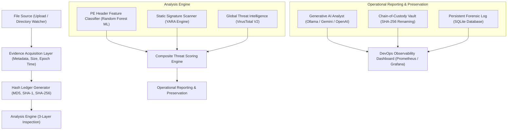
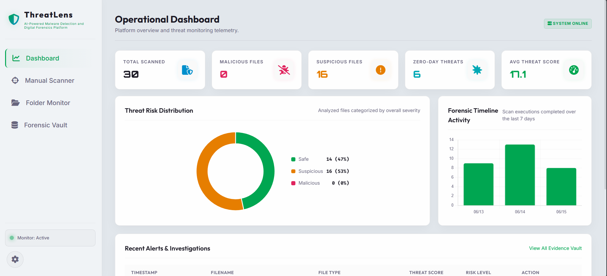
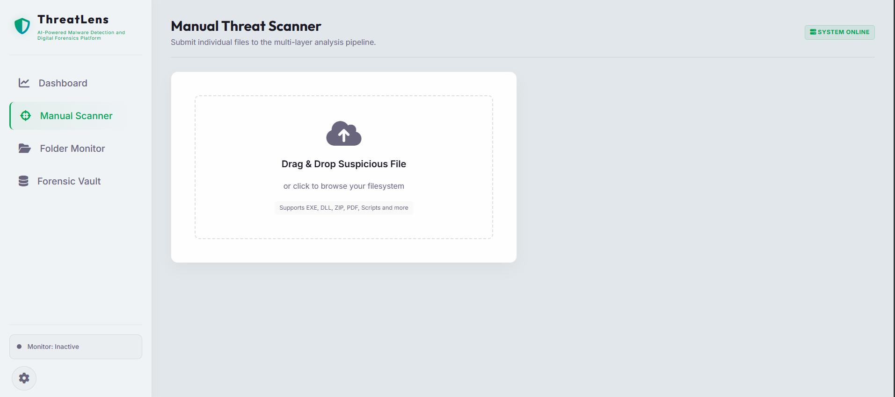
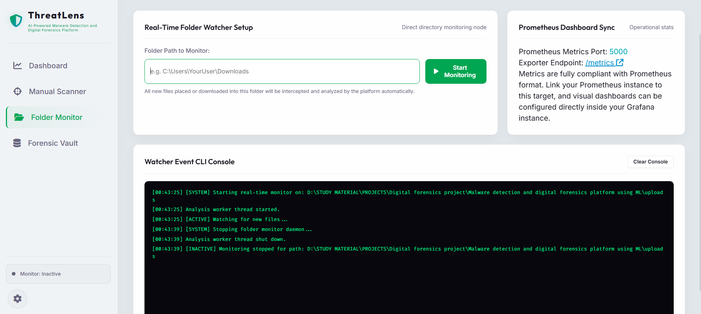
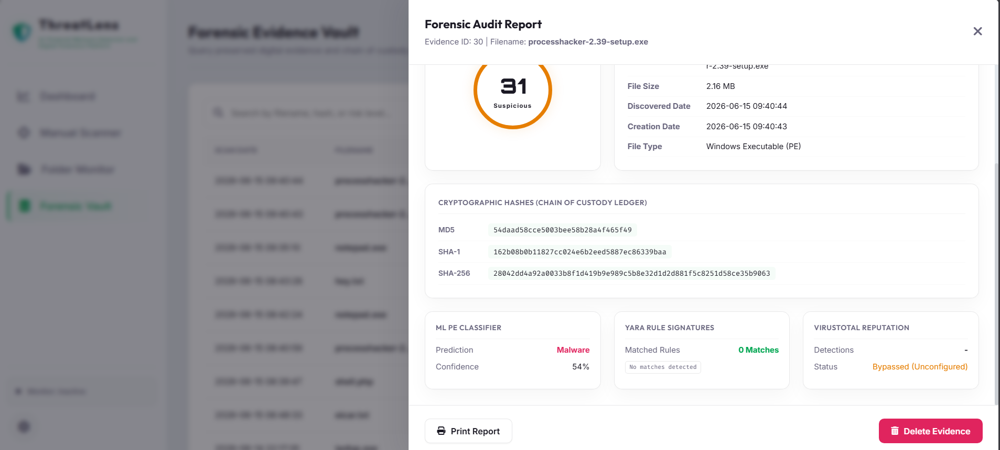
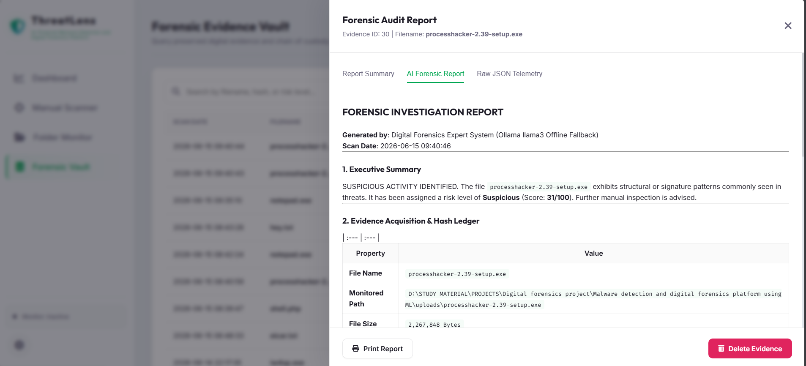
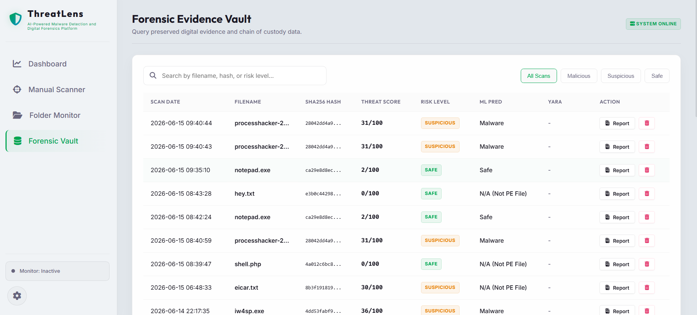
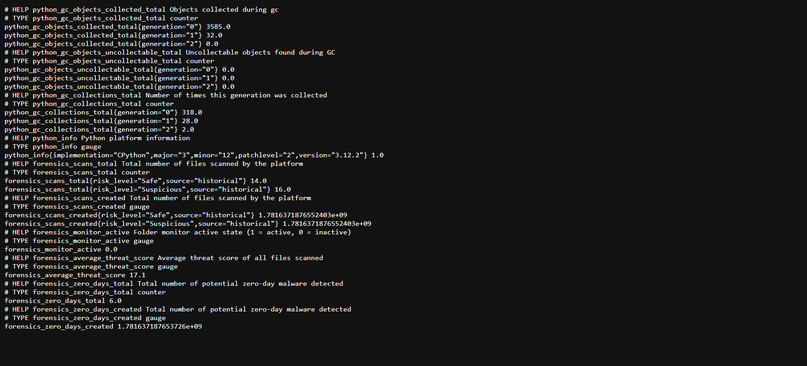

# 🛡️ ThreatLens: Multi-Layer Malware Detection & Digital Forensics Platform

[](https://www.python.org/)
[](https://opensource.org/licenses/MIT)
[](https://www.docker.com/)
[](https://prometheus.io/)

ThreatLens is an integrated digital forensics and malware analysis platform designed to capture suspicious files, perform deep static and structural analysis, archive threat evidence, and draft AI-assisted forensic reports. 

Unlike traditional security software focused strictly on quarantine and deletion, ThreatLens serves as a **Threat Hunting and Incident Response Tool**. It preserves the cryptographic integrity of files, builds historical evidence logs, and helps security analysts understand *how* an attack works, *what* indicators of compromise (IOCs) are present, and *how* to contain the threat.

---

## 🏗️ System Architecture



---

## 🎨 Visual Interface Tour

### 📊 1. Operational Dashboard
The main command center displays real-time telemetry, threat distribution charts, daily scan trends, average system threat scores, and a running list of active scans.


---

### 🔬 2. Manual Scanner Pipeline
Submit individual files to the multi-layer inspection pipeline. Analysts can drag and drop suspicious files (EXEs, DLLs, ZIPs, PDFs, scripts, and other file types) to launch the acquisition scan.


---

### 📁 3. Real-Time Watcher Node
Select any directory on the local system to deploy an active background observer. The node automatically walks subdirectories, queues incoming files, and streams events to the live console, synchronizing metrics to Prometheus.


---

### 📝 4. Forensic Audit Report (Overview & AI Report)
The platform compiles all indicators of compromise (IOCs), hashes, and scanning parameters into a visual summary panel, featuring an interactive tabs interface to toggle between visual summaries, detailed AI-generated reports, and raw JSON telemetry payloads.



---

### 🏛   5. Forensic Evidence Vault
Search, filter, and audit all analyzed threats. The vault maintains SHA-256 hashes, file classifications, matched signature tags, and links to the cryptographically preserved binary file.


---

### 📈 6. Prometheus Observability Metrics
System telemetry is exposed dynamically at the `/metrics` endpoint, allowing Prometheus scraper daemons to scrape operational data in real time.


---

## 🌟 Core Pillars

### 1. Multi-Layered Threat Scanners
*   **PE Header ML Classifier**: Runs a Random Forest classifier trained on the EMBER dataset. It inspects 23 critical Portable Executable (PE) compilation headers (DLL characteristics, sections, entropy, stack reserve) to detect zero-day compiled binaries.
*   **Static YARA Rules**: Scans any file type (scripts, documents, archives) for static indicators like process hollowing API calls (`VirtualAllocEx`, `WriteProcessMemory`), obfuscated PowerShell download cradles, cryptocurrency wallet paths, and reverse shells.
*   **VirusTotal Reputation**: Checks file hashes against global threat intelligence vendors to verify known exploits.

### 2. Composite Threat Scoring Engine
ThreatLens calculates a normalized threat score between `0` and `100` based on weighted inputs:
*   **ML Classifier (Max 40 points)**: Weighted based on prediction class and probability confidence.
*   **YARA Matches (Max 30 points)**: 15 points per signature match, capped at 30.
*   **VirusTotal Reputation (Max 30 points)**: Scaled by detection ratio.
*   **Risk Level Classification**:
    *   🔴 `60 - 100`: **Malicious**
    *   🟡 `20 - 59`: **Suspicious**
    *   🟢 `0 - 19`: **Safe**

### 3. AI-Powered Forensics Reporter
Integrates three Generative AI endpoints to synthesize security telemetry:
*   **Ollama**: Connects locally to model backends (like `llama3`, `mistral`, or `deepseek-coder`) for offline air-gapped analyses.
*   **Google Gemini Cloud API**: Leverages the `gemini-1.5-flash` model for advanced analysis.
*   **OpenAI-Compatible APIs**: Links with remote endpoints, LM Studio, or llama.cpp servers.
*   *Fallback*: A local rule-based expert parser that writes structured reports if LLMs are offline.

### 4. Chain-of-Custody Archiving
When a threat is processed:
1.  Telemetry is saved in the SQLite database [forensics.db](file:///d:/STUDY%20MATERIAL/PROJECTS/Digital%20forensics%20project/Malware%20detection%20and%20digital%20forensics%20platform%20using%20ML/forensics.db).
2.  The target file is copied to an isolated directory `evidence_vault/`.
3.  The file is renamed to its unique SHA-256 hash value (preserving cryptographic integrity and preventing duplicates).

---

## 🚀 Getting Started

### Installation
1.  **Clone this repository**:
    ```bash
    git clone <your-repository-url>
    cd ThreatLens
    ```
2.  **Create a Virtual Environment**:
    ```bash
    python -m venv venv
    # Windows:
    .\venv\Scripts\Activate.ps1
    # Linux/macOS:
    source venv/bin/activate
    ```
3.  **Install dependencies**:
    ```bash
    pip install -r requirements.txt
    ```

### Configuration
Create a `.env` file in the project root:
```ini
# VirusTotal API Config
VIRUSTOTAL_API_KEY=your_virustotal_key_here

# Generative AI Reporting Config
GEMINI_API_KEY=your_gemini_key_here
OPENAI_API_KEY=your_openai_key_here
```

### Running the App
1.  **Start the local LLM** (if using Ollama):
    ```bash
    ollama run llama3
    ```
2.  **Launch the Flask application**:
    ```bash
    python app.py
    ```
3.  Open [http://localhost:5000](http://localhost:5000) in your browser.

### Deploying Metrics (Docker)
Ensure Docker is running, then start the monitoring containers:
```bash
docker compose -f metrics/docker-compose.yml up -d
```
*   **Prometheus**: [http://localhost:9090](http://localhost:9090) (Scrapes data from the Flask `/metrics` endpoint).
*   **Grafana Dashboard**: [http://localhost:3000](http://localhost:3000) (Default login: `admin` / `admin`).

---

## 📜 Credits & Attributions
ThreatLens integrates and extends the machine learning model weights (`malwareclassifier-V2.pkl`) and PE feature extraction logic developed by **[0xfke](https://github.com/0xfke)** in their project: [Malware-Detection-and-Analysis-using-Machine-Learning](https://github.com/0xfke/Malware-Detection-and-Analysis-using-Machine-Learning).

---

## 📄 License
This project is licensed under the MIT License - see the `LICENSE` file for details.
